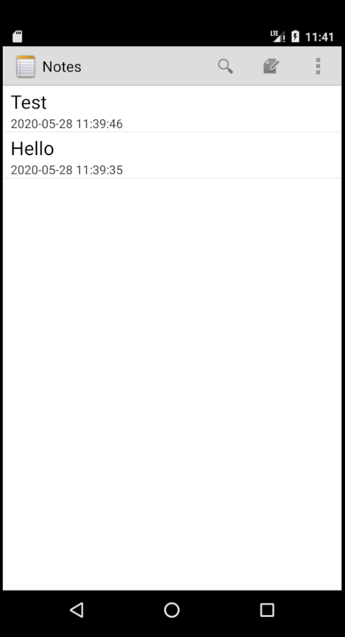
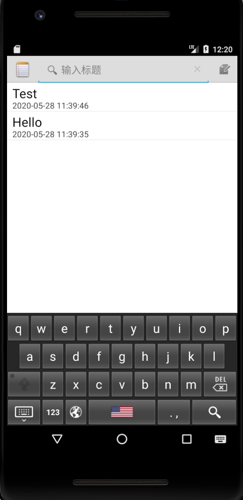
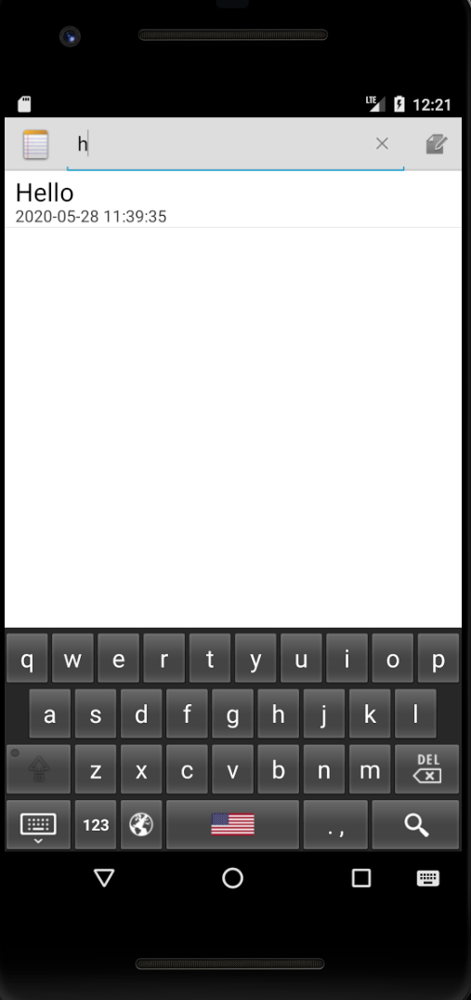

# 期中实验  **基于**NotePad应用功能扩展

**本实验将基于NotePad应用做功能扩展。**

**实验包含两个功能的扩展：** 

NoteList中显示条目增加时间戳显示 。

添加笔记查询功能（根据标题查询）。


## 功能一  NoteList中显示条目增加时间戳显示

获取笔记修改的时间

在NotesEditor.java中添加获取当前时间的函数（仅显示修改的部分）

```java
@TargetApi(Build.VERSION_CODES.N)
public String getFormatData(){
    long time=System.currentTimeMillis();//long now = android.os.SystemClock.uptimeMillis();
    SimpleDateFormat format=new SimpleDateFormat("yyyy-MM-dd HH:mm:ss");//使用该格式避免时间显示成数字集。
    Date mdata=new Date(time);
    String mtime=format.format(mdata);
    return mtime;
}
private final void updateNote(String text, String title) {    // Sets up a map to contain values to be updated in the provider.
    ContentValues values = new ContentValues();
    //在笔记创建或修改时获时间信息
    values.put(NotePad.Notes.COLUMN_NAME_MODIFICATION_DATE, getFormatData());
    values.put(NotePad.Notes.COLUMN_NAME_CREATE_DATE, getFormatData());
    // If the action is to insert a new note, this creates an initial title for it.
    if (mState == STATE_INSERT) {
    // If no title was provided as an argument, create one from the note text.
    	if (title == null) { 
    		// Get the note's length      
   	 		int length = text.length();
    		// Sets the title by getting a substring of the text that is 31 characters long
            // or the number of characters in the note plus one, whichever is smaller.
    		title = text.substring(0, Math.min(30, length)); 
        	// If the resulting length is more than 30 characters, chops off any 
            // trailing spaces
            if (length > 30) {
                int lastSpace = title.lastIndexOf(' ');
                if (lastSpace > 0) {
                    title = title.substring(0, lastSpace);
                }
            }
            // In the values map, sets the value of the title            
            values.put(NotePad.Notes.COLUMN_NAME_TITLE, title);
        }
} else if (title != null) {
        // In the values map, sets the value of the title
        values.put(NotePad.Notes.COLUMN_NAME_TITLE, title);
    }
    // This puts the desired notes text into the map. 
    values.put(NotePad.Notes.COLUMN_NAME_NOTE, text);
```

在noteslist_item.xml添加线性布局，并添加时间戳条目

```xml
<LinearLayout xmlns:android="http://schemas.android.com/apk/res/android"
        android:background="@color/white"
        android:orientation="vertical"
        android:layout_height="match_parent"
        android:layout_width="wrap_content"
        android:layout_weight="1"
        >
        <TextView xmlns:android="http://schemas.android.com/apk/res/android"
            android:id="@android:id/text1"
            android:layout_width="match_parent"
            android:textColor="@color/black"
            android:layout_height="30dp"
            android:textAppearance="?android:attr/textAppearanceLarge"
            android:textSize="23dp"
            android:gravity="center_vertical"
            android:paddingLeft="10dp"
            android:paddingTop="3dp"
            android:singleLine="true"
            />
        <TextView xmlns:android="http://schemas.android.com/apk/res/android"
            android:id="@+id/time1"
            android:layout_width="match_parent"
            android:paddingLeft="10dp"
            android:layout_height="20dp"
            android:textSize="15dp"
            android:singleLine="true"
            />
    </LinearLayout>
```
在NotesList.java中新增加时间属性

```java
private static final String[] PROJECTION = new String[] {
    NotePad.Notes._ID, // 0
	NotePad.Notes.COLUMN_NAME_TITLE,// 1
	NotePad.Notes.COLUMN_NAME_MODIFICATION_DATE,
};
Cursor cursor = managedQuery(
            getIntent().getData(),            // Use the default content URI for the provider.
            PROJECTION,                       // Return the note ID and title for each note.
            null,                             // No where clause, return all records.
            null,                             // No where clause, therefore no where column values.
            NotePad.Notes.DEFAULT_SORT_ORDER  // Use the default sort order.
        );
        /*
         * The following two arrays create a "map" between columns in the cursor and view IDs
         * for items in the ListView. Each element in the dataColumns array represents
         * a column name; each element in the viewID array represents the ID of a View.
         * The SimpleCursorAdapter maps them in ascending order to determine where each column
         * value will appear in the ListView.
         */

        // The names of the cursor columns to display in the view, initialized to the title column
        String[] dataColumns = { NotePad.Notes.COLUMN_NAME_TITLE , NotePad.Notes.COLUMN_NAME_MODIFICATION_DATE } ;
```


##### 效果图




## 功能二  NoteList中显示条目增加时间戳显示

在list_options_menu.xml中新建搜索框

```xml
<item
      android:id="@+id/action_search"
      android:actionViewClass="android.widget.SearchView"
      android:showAsAction="always"
      android:title="搜索"/>
```

修改onCreateOptionsMenu的部分代码，新建搜索框，然后根据用户的输入进行搜索

```java
@Overridepublic boolean onCreateOptionsMenu(Menu menu) {
    //Inflate menu from XML resource
    MenuInflater inflater = getMenuInflater();
    inflater.inflate(R.menu.list_options_menu, menu);
    //添加搜索框
    MenuItem searchItem = menu.findItem(R.id.action_search);
    SearchView mSearchView = (SearchView) searchItem.getActionView();
    mSearchView.setSubmitButtonEnabled(false);
    //设置输入框提示语
    mSearchView.setQueryHint("输入标题");
    //取消搜索按钮
    mSearchView.setOnCloseListener(new SearchView.OnCloseListener() {
        @Override
        public boolean onClose() {
            return false;
        }
    });
    //点击搜索时弹出搜索栏
    mSearchView.setOnSearchClickListener(new View.OnClickListener() {
        @Override
        public void onClick(View v) {
        }
    });
    //搜索框文字变化监听
    mSearchView.setOnQueryTextListener(new SearchView.OnQueryTextListener() {
        @Override
        public boolean onQueryTextSubmit(String s) {
            return false;
        }
        @Override
        public boolean onQueryTextChange(String s) {
            /* Performs a managed query. 
            The Activity handles closing and requerying the cursor
            * when needed.
            *
            * Please see the introductory note about performing provider operations on the UI thread.
            */
            String mslection = new String (NotePad.Notes.COLUMN_NAME_TITLE+" LIKE '%"+s+"%'"  );
            String[] mArgs = new String[] {  s  };
            Cursor cursor = managedQuery(
                getIntent().getData(),// Use the default content URI for the provider.
                PROJECTION,// Return the note ID and title for each note. 
                mslection,// No where clause, return all records. 
                null,// No where clause, therefore no where column values.
                NotePad.Notes.DEFAULT_SORT_ORDER // Use the default sort order. );
                /*
                * The following two arrays create a "map" between columns in the cursor and view IDs
                * for items in the ListView. Each element in the dataColumns array represents
                * a column name; each element in the viewID array represents the ID of a View.
                * The SimpleCursorAdapter maps them in ascending order to determine where each column
                * value will appear in the ListView.
                */ 
                // The names of the cursor columns to display in the view, initialized to the title column
                String[] dataColumns = { NotePad.Notes.COLUMN_NAME_TITLE , NotePad.Notes.COLUMN_NAME_MODIFICATION_DATE } ;
                // The view IDs that will display the cursor columns, initialized to the TextView in
                int[] viewIDs = { android.R.id.text1, R.id.time1 };
                setListAdapter(adapter);
                return false;
                }
                });
            // 配置SearchView的属性
            // Generate any additional actions that can be performed on the
            // overall list.  In a normal install, there are no additional
            // actions found here, but this allows other applications to extend
            // our menu with their own actions.
            Intent intent = new Intent(null, getIntent().getData());
            intent.addCategory(Intent.CATEGORY_ALTERNATIVE);
            menu.addIntentOptions(Menu.CATEGORY_ALTERNATIVE, 0, 0,
                                  new ComponentName(this, NotesList.class), null, intent, 0, null);
            return super.onCreateOptionsMenu(menu);}
```

##### 效果图



##### 输入标题进行模糊搜索

